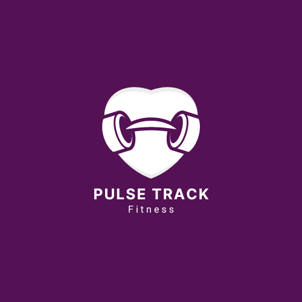

#  Pulse Track Fitness
## O que é o aplicativo?
O Pulse Track Fitness é um aplicativo que registra atividades físicas e monitora progresso.
 
## Suas funcionalidades
- Registro de atividade físicas(corridas, caminhada, ciclismo, etc).
- Monitoramento de progresso diário, semanal, e mensal;
- Sincronização de dados em tempo real.
- Notificação push para lembrar os usuários de suas metas;
- Integração com APIs de dispositivos móveis (por exemplos, GPS para rastreamento de corridas).

 ### Escolha das Tecnologias
 - Frontend(Mobile App):Utilizado Angular combinado com Ionic para desenvolver um aplicativo mobile híbrido que funciona em Androis e iOS.
 - Backend: Utilizamos Node.js com Express para criar uma API RESTful que o aplicativo consumirá para registrar as atividades e monitorar o progresso.
 - Banco de Dados: MongoDB para armazenar os dados dos usuários, atividades registradas, e progresso.
 - Sincronização em Tempo Real: Feito o uso de Socket.io e Firebase para garantir que os dados sejam sincronizados em tempo real.
 - Notificação Push: Firebase Cloud Messaging(FCM) para gerenciar as notificações push.
 - Integração com as APIs: Foi feito o uso de APIs nativas do dispositivo (como o GPS) através do Cordova para coletar dados de atividade físicas.
### Links das Tecnologias
- [Angular](https://angular.io/)
- [Ionic](https://ionicframework.com/)
- [Node.js](https://nodejs.org/en/)
- [Express](https://expressjs.com/)
- [MongoDB](https://www.mongodb.com/)
- [Socket.io](https://socket.io/)
- [Firebase](https://firebase.google.com/)
- [Firebase Cloud Messaging (FCM)](https://firebase.google.com/products/cloud-messaging)
- [Cordova](https://cordova.apache.org/)
